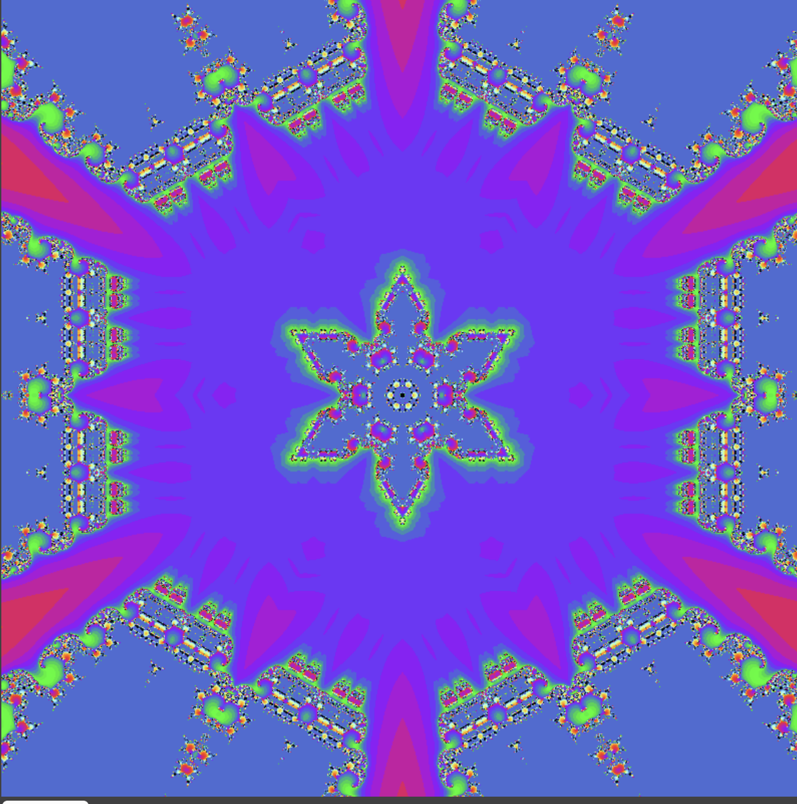
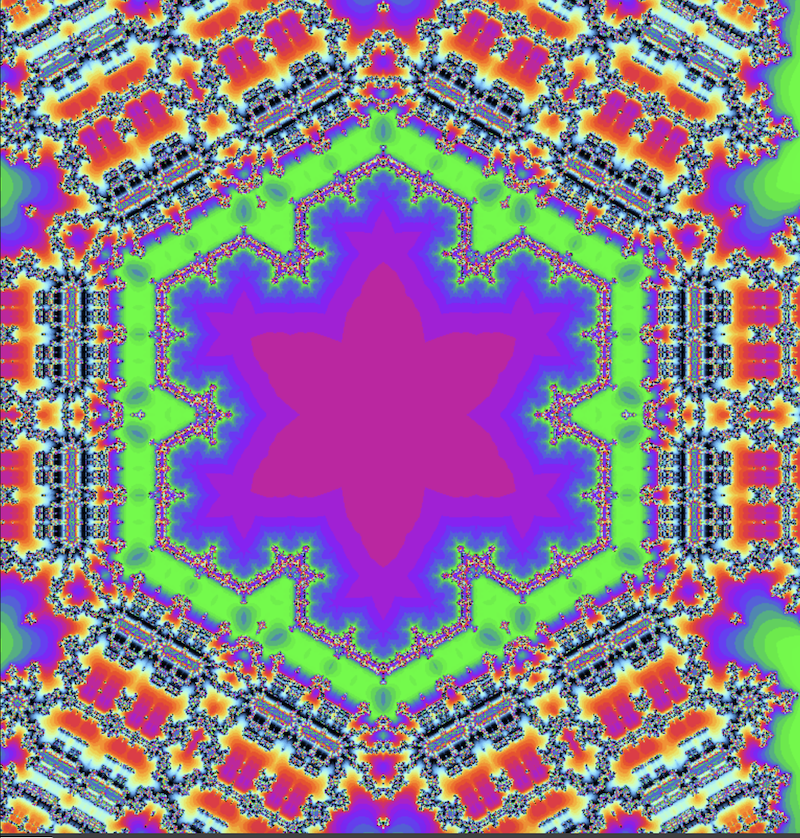
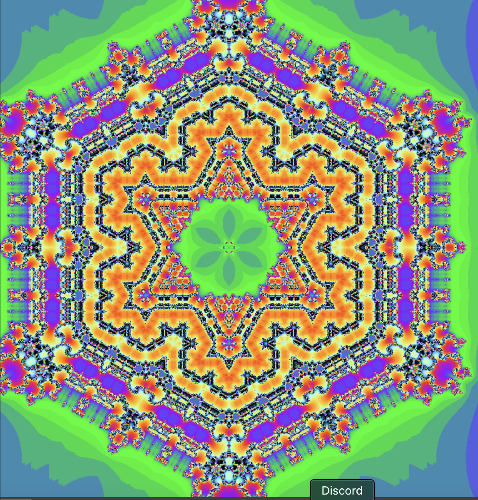

# Julia Set Kaleidescope

## This repository contains p5.js sketches that render the julia set within the Koch curve using different values of c.

[Link to p5.js sketch] https://editor.p5js.org/kfahn/full/ujLsCeNRb
[Link to code] https://github.com/kfahn22/julia_kaleidescope/tree/main/julia_set

### c = 0.285, 0.0

### c = -0.70176, -0.3842

### c = -0.835, -0.232

