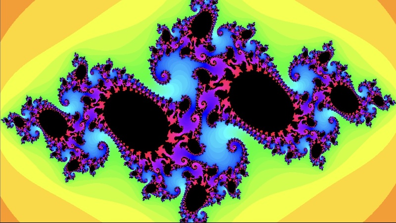
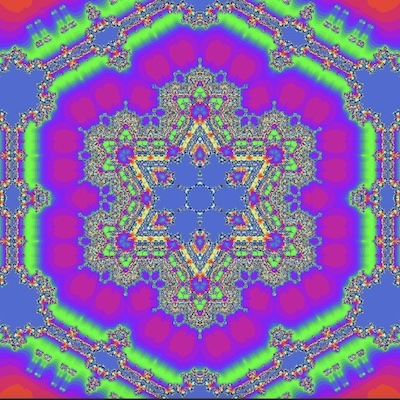
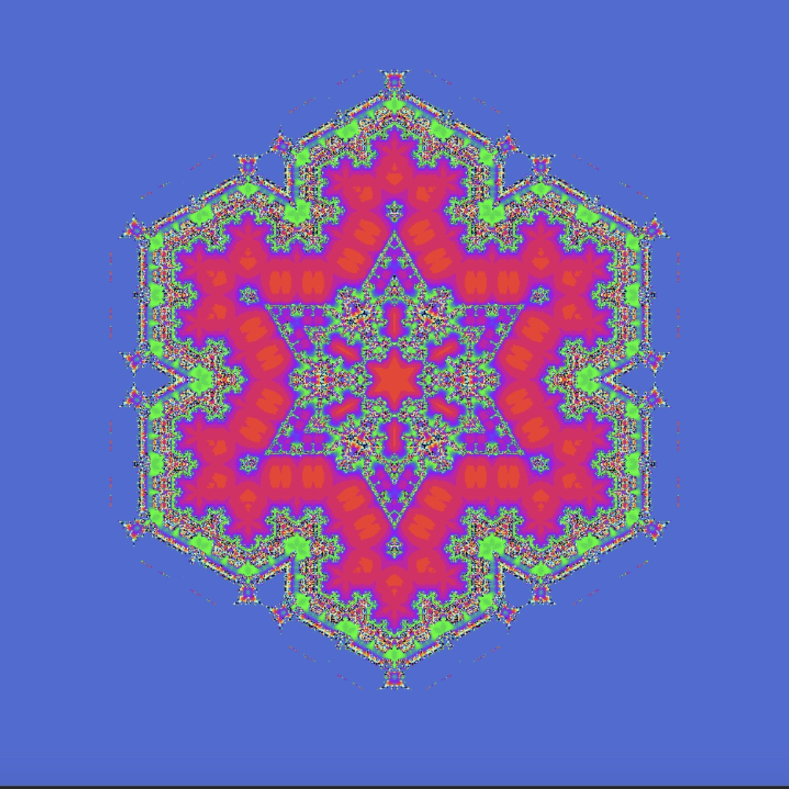
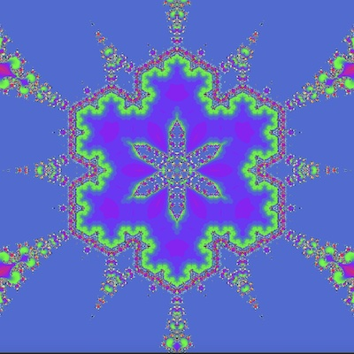

# Julia Set Kaleidescope

## This repository contains a p5.js sketch that render the Julia set within the Koch curve using different values of c.

My first introduction to the Julia set was <a href="https://thecodingtrain.com/challenges/22-julia-set">Daniel Shiffman's</a> Julia Set coding challenge.  

Image rendered by Daniel's [P5 sketch](https://editor.p5js.org/codingtrain/sketches/G6qbMmaI).

My sketch renders the Julia set within a kaleiscope using a shader.  The code is based on the 
[Shader Coding: KIFS Fractals explained!](https://www.youtube.com/watch?v=il_Qg9AqQkE) youtube tutorial by the Art of Code.

[Live version](https://kfahn22.github.io/julia_kaleidescope/)

Julia set kaleidescope with c = (-0.6999, 0.37999)    

Julia set kaleidescope with c = (-0.70176, 0.3842)    

Julia set kaleidescope with c = (0.285, 0.01)    

[P5 sketch](https://editor.p5js.org/kfahn/sketches/ujLsCeNRb)  
[Code](https://github.com/kfahn22/julia_kaleidescope/tree/main/julia_set)
