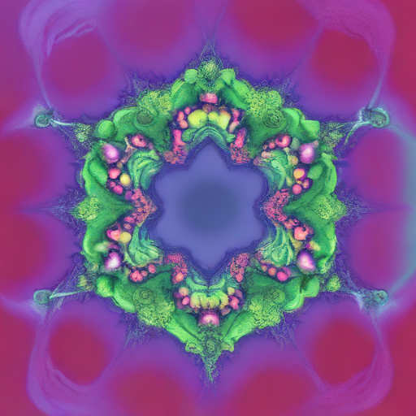
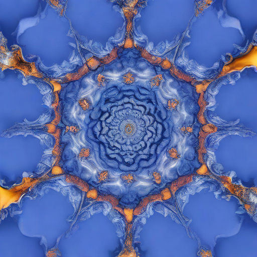
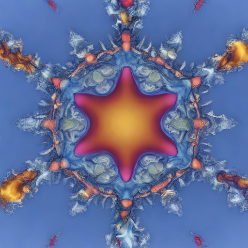
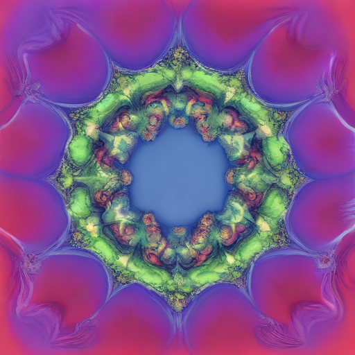
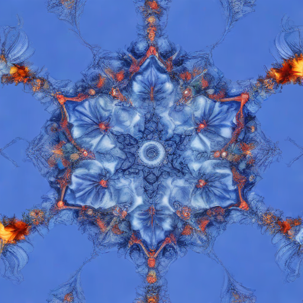

# Julia Set Kaleidoscope

## This repository contains visualizations of the Julia Set.

My first introduction to the Julia set was Daniel Shiffman's Julia Set [Coding Challenge](https://thecodingtrain.com/challenges/22-julia-set). This is an image rendered by Daniel Shiffman's [P5 sketch](https://editor.p5js.org/codingtrain/sketches/G6qbMmaI):

## Gallery

The first row shows the Julia set within the Koch curve rendered with a shader in P5.js for different values of c. The code is based on the [Shader Coding: KIFS Fractals explained!](https://www.youtube.com/watch?v=il_Qg9AqQkE) youtube tutorial by the Art of Code.

The second set of images were generated using the stabilityai/sdxl-turbo image2image model. I created a dataset of Julia Set kaleidoscope images using this [P5.js sketch](https://editor.p5js.org/kfahn/sketches/vugGJY9Gm) and pushed them to the [Hugging Face hub](https://huggingface.co/datasets/kfahn/kaleidoscope) using this [notebook](push_kaleidoscope_data_to_HF_hub.ipynb). You can try out the code with this [notebook](mandelbulb_kaleidoscope.ipynb).

For the third set of images, I used [fastGAN](https://github.com/odegeasslbc/FastGAN-pytorch) to generate the conditioning image. The model checkpoints can be found [here](https://huggingface.co/kfahn/JKGan/tree/main).

<!-- IMAGE-LIST:START - Do not remove or modify this section -->
<!-- prettier-ignore-start -->
<!-- markdownlint-disable -->
<table>
  <tbody>
    <tr>
      <td align="center"><a href="jhttps://editor.p5js.org/kfahn/sketches/ujLsCeNRb">  <b>c = (-0.6999, 0.37999) Julia Kaleidoscope</b></a></td>
      <td align="center"><a href="https://editor.p5js.org/kfahn/sketches/ujLsCeNRb">  <b>c = (-0.70176, 0.3842) Julia Kaleidoscope</b></a></td>
      <td align="center"><a href="https://editor.p5js.org/kfahn/sketches/ujLsCeNRb">  <b>c = (0.285, 0.01) Julia Kaleidoscope</b></a></td>
    </tr>
    <tr>
      <td align="center"><a href="">  <b> Mandelbulb Kaleidoscope</b></a></td>
      <td align="center"><a href="">  <b> Mandelbulb Kaleidescope</b></a></td>
      <td align="center"><a href="">  <b> Mandelbulb Kaleidoscope</b></a></td>
    </tr>
    <tr>
      <td align="center"><a href="">  <b> Mandelbulb Kaleidoscope</b></a></td>
      <td align="center"><a href="">  <b> Mandelbulb Kaleidoscope</b></a></td>  
    </tr>
     </tbody>
</table>
<table>
  <tbody>
    <tr>
      <td align="center"><a href="">  <b> JuliaGAN Kaleidoscope</b></a></td>
      <td align="center"><a href="">  <b> JuliaGAN Kaleidoscope</b></a></td> 
      <td align="center"><a href="">  <b> JuliaGAN Kaleidoscope</b></a></td> 
    </tr>
     <tr>
      <td align="center"><a href="">  <b> JuliaGAN Kaleidoscope</b></a></td>
      <td align="center"><a href="">  <b> JuliaGAN Kaleidoscope</b></a></td> 
      <td align="center"><a href="">  <b> JuliaGAN Kaleidoscope</b></a></td> 
    </tr>
     </tbody>
</table>

<!-- markdownlint-restore -->
<!-- prettier-ignore-end -->

<!-- IMAGE-LIST:END -->

## Animation

I am using the new p5 saveGif() function to render the GIF. The animation is created by zooming in on the Julia set for one value of c.

- [P5 sketch](https://editor.p5js.org/kfahn/sketches/Zlzw2yIOL)
- [Code](https://github.com/kfahn22/julia_kaleidescope/tree/main/animation)
